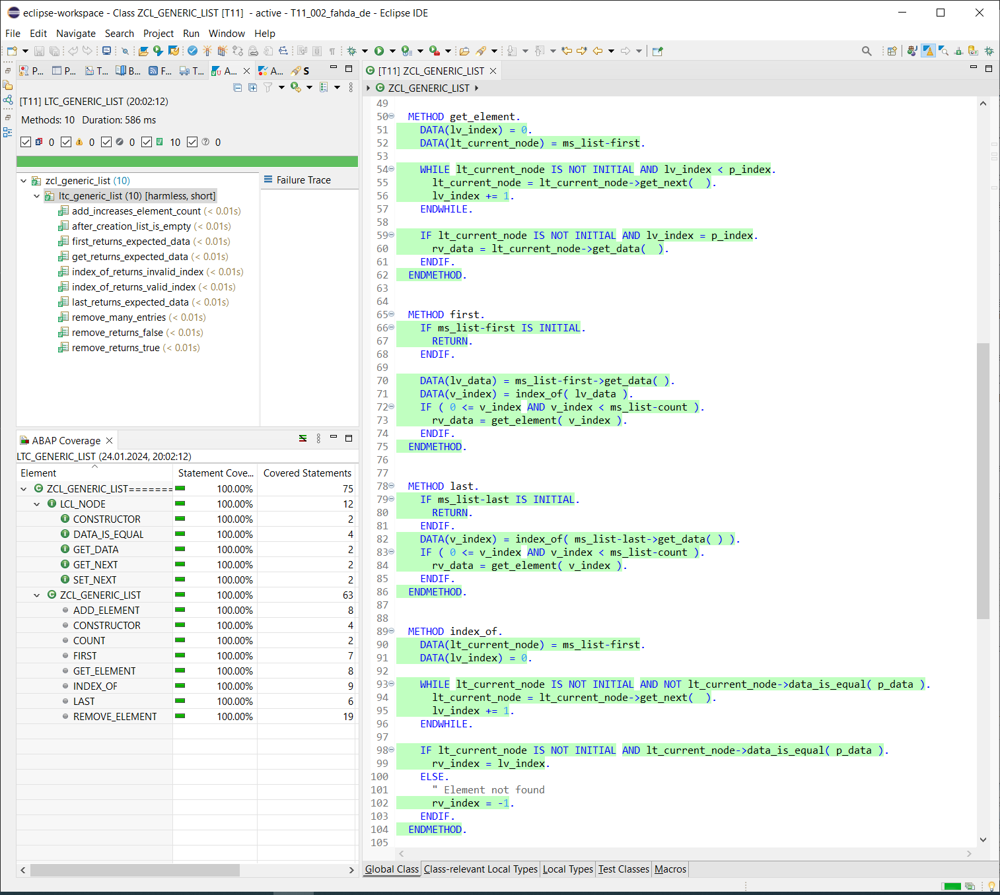

# ABAP Snippets

### Coverage Example

### REST Example

1. sign up to get your API key -> [Rapid API Hub](https://rapidapi.com/hub)
    - see screenshot below

2. in order to run [restapi.http](/Rest_Example/restapi.http)
    - enter your personal API key in the [.env](/Rest_Example/.env) file 
    - install `REST Client` extension in VSC

3. in order to run [restapi.py](/Rest_Example/restapi.py)
    - create environment variable `RAPIDAPI_KEY`
    - assign your personal API key to it

